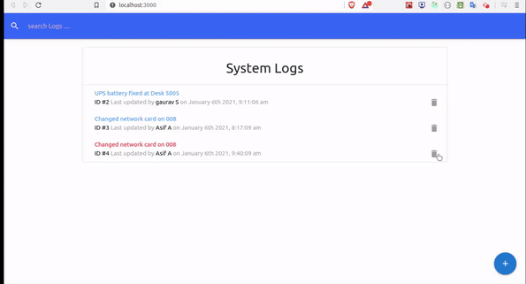

# IT logger Application

 IT logger is an apllication which basicaaly helps to keep track of all important operations and task in the company. You can add , delete and update the task. Also you can assign specific technician to complete that task. 

## Tech Stack used :

<ul>
    <li>ReactJS </li>
    <li>Redux (State Management)</li>
    <li>JSON server (fake backend API)</li>
    <li>HTML</li>
    <li>Materialize CSS</li>
 </ul>

